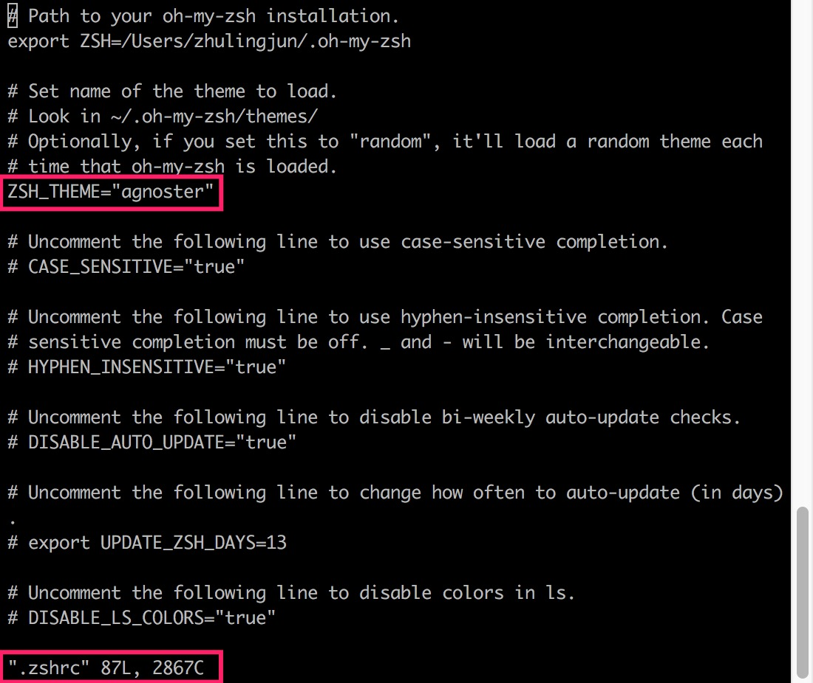
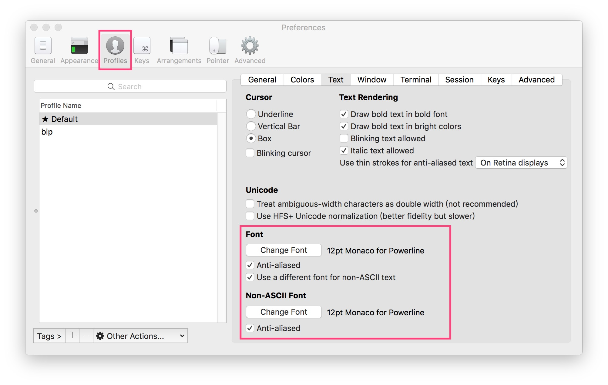

## iTerm2

### 下载
[https://www.iterm2.com/](https://www.iterm2.com/)

### oh-my-zsh
安装[oh-my-zsh](https://github.com/robbyrussell/oh-my-zsh) 
`sh -c "$(curl -fsSL https://raw.githubusercontent.com/robbyrussell/oh-my-zsh/master/tools/install.sh)"`

### 主题
安装[agnoster](https://gist.github.com/agnoster/3712874)主题 

### 字体
因为主题中包含的箭头会产生乱码，需要安装相关字体，并在iTerm2中进行配置。 
字体下载地址[https://github.com/powerline/fonts](https://github.com/powerline/fonts) 
安装`sh install.sh` 

